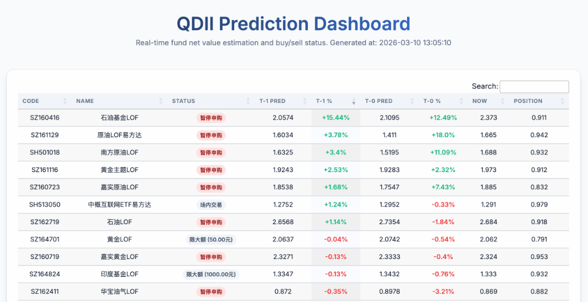

# xalpha

[](https://pypi.org/project/xalpha/)
[](https://xalpha.readthedocs.io/)
[](https://codecov.io/gh/refraction-ray/xalpha)
[](https://badges.mit-license.org/)

**The full lifecycle management for fund investment**

Retrieval of fund/stock information and net values, precise investment account record integration and analysis with rich visualizations, simple strategy backtesting, and automated investment reminders based on preset strategies. Specifically suitable for the overview and management analysis of fixed investment (DCP) and grid investment with frequent capital flows. [AI agent native supported](https://xalpha.readthedocs.io/en/latest/xalpha_agent/index.html).

🎉 Since version 0.3, it supports universal daily and real-time data retrievers. A unified interface can fetch price data for almost any product in the market with one line of code for analysis.

🍭 Since version 0.9, it supports underlying holding configuration and stock detail transparency for fund portfolios. Mastering underlying holdings and tracking institutional stock pools and trading characteristics has never been easier.

Get fund info in one line:

```python
nfyy = xa.fundinfo("501018")
```

One line to simulate the entire fund portfolio based on records, matching the actual portfolio exactly:

```python
jiaoyidan = xa.record(path) # One extra line to read the csv records at path
shipan = xa.mul(status=jiaoyidan) # Let's rock
shipan.summary() # See the summary effect of all funds
shipan.get_stock_holdings() # View underlying equivalent stock holdings
```

One line to get historical daily data or real-time data for various financial products:

```python
xa.get_daily("SH518880") # Historical data for Shanghai/Shenzhen markets
xa.get_daily("USD/CNY") # Historical data for USD/CNY middle rate
xa.get_rt("commodities/crude-oil") # Real-time data for crude oil futures
xa.get_rt("HK00700", double_check=True) # Real-time data with high stability and double validation
```

One line to get historical and real-time valuation analysis for indices, industries, funds, and individual stocks (The index part requires JoinQuant data, local trial application or direct running on the JoinQuant cloud platform)

```python
xa.PEBHistory("SH000990").summary()
xa.PEBHistory("F100032").v()
```

One line to price convertible bonds:

```python
xa.CBCalculator("SH113577").analyse()
```

One line to estimate fund net value (supports core QDII funds T-1 and real-time T-0 net value prediction based on futures)

 ```python
 xa.QDIIPredict("SH501018", positions=True).get_t0_rate()
 ```

xalpha is more than that, more features are waiting for you to explore. Not just data, but a tool!

## Documentation

Online documentation: https://xalpha.readthedocs.io/

Or read the documentation locally in `doc/build/html` by running the following command:

```bash
$ cd doc
$ make html
```

## Installation

```bash
pip install xalpha
```

Currently only supports Python 3.

To try the latest version:

```bash
$ git clone https://github.com/refraction-ray/xalpha.git
$ cd xalpha && pip3 install .
```

## Usage

### Local Usage

Due to rich visualization support, it is recommended to use with Jupyter Notebook. You can refer to the example links given [here](https://xalpha.readthedocs.io/en/latest/demo.html) to quickly master most functions.

**Supports K-line and historical valuation visualization analysis for multi-market indices and individual stocks:**


**Historical net value of investment accounts and cost deviation analysis of various funds based on underlying data:**


**T-1 net value prediction for core QDII funds and T-0 real-time net value dashboard based on futures:**



**Automatic penetration of holdings to get the equivalent stock concentration and industry distribution of the fund portfolio:**


### Usage on Quant Platforms

Taking JoinQuant as an example, open the Jupyter Notebook of the JoinQuant research environment and run the following commands:

```python
>>> !pip3 install xalpha --user
>>> import sys
>>> sys.path.insert(0, "/home/jquser/.local/lib/python3.6/site-packages")
>>> import xalpha as xa
```

Then you can use xalpha normally on the quant cloud platform and seamlessly integrate it with the data provided by the cloud platform.

If you want to try the latest development version of xalpha in the cloud research environment, the required configuration is as follows:

```python
>>> !git clone https://github.com/refraction-ray/xalpha.git
>>> !cd xalpha && python3 setup.py develop --user
>>> import sys
>>> sys.path.insert(0, "/home/jquser/.local/lib/python3.6/site-packages")
>>> import xalpha as xa
```

Since xalpha integrates APIs for some JoinQuant data sources, you can activate the JoinQuant data source by directly running `xa.provider.set_jq_data(debug=True)` in the cloud.

## Acknowledgments

Thanks to [Jisilu](https://www.jisilu.cn) for supporting and sponsoring this project. You can check the QDII fund net value prediction built on the xalpha engine [here](https://www.jisilu.cn/data/qdii/#qdiie) (Delisted in March 2026 for compliance reasons).

## Disclaimer

This project only provides example code for obtaining public data and does not provide any data storage or services.
Software users must comply with the relevant website terms of use and laws and regulations.

## Blog 

- [The Birth of xalpha](https://re-ra.xyz/xalpha-%E8%AF%9E%E7%94%9F%E8%AE%B0/)

- [The Design Philosophy of xalpha and More](https://re-ra.xyz/xalpha-%E8%AE%BE%E8%AE%A1%E5%93%B2%E5%AD%A6%E5%8F%8A%E5%85%B6%E4%BB%96/)
